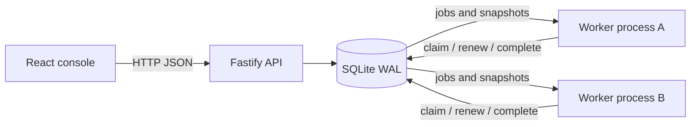
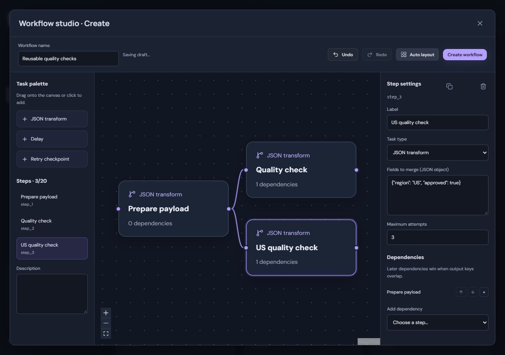

# TaskHarbor

[](https://github.com/22507260/TaskHarbor/actions/workflows/ci.yml)

A local-first workflow operations platform: compose dependency graphs, run background jobs and inspect every attempt from a usable web console.

TaskHarbor is an evolving full-stack engineering project. Version 0.2.1 provides a working execution engine and UI; the roadmap grows it toward a multi-user, PostgreSQL-backed service.


## Run locally

Requires **Node.js 24.x** and npm. Docker and external services are not required.

```sh
npm ci
npm run dev
```

Open [localhost:5173](http://127.0.0.1:5173). This starts the API, one worker and Vite. Three sample workflows are seeded only when the database has no workflows.

1. Run **Resilient delivery** to see two controlled failures, backoff and a successful third attempt.
2. Open **New workflow**. Add tasks from the palette, connect their handles or use the dependency selector, then save.
3. Open a run to inspect step state, worker ownership, attempts, events and JSON outputs.
4. Start `npm run worker` in a second terminal to execute independent branches concurrently. Run **Parallel quality gates** to observe that behavior.
5. Cancel an active run to invalidate its outstanding job leases.

For a built client, run `npm run build`, then `npm start` and `npm run worker` in separate terminals. Open [localhost:4310](http://127.0.0.1:4310).

## What works today

- React + TypeScript console with a visual workflow studio, local draft recovery, undo/redo, responsive layouts, version history, dependency previews, execution history and a run inspector.
- Fastify API with Zod validation for unique step IDs, acyclic dependencies, missing dependencies and bounded task settings.
- SQLite persistence with WAL and transactional job claims across worker processes on the same machine.
- Five-second leases, one-second renewal, recovery after worker failure and fencing of stale results.
- Persisted attempts, exponential retry backoff, dependency failure propagation and run cancellation.
- Immutable workflow revisions with optimistic editing, versioned run snapshots, worker heartbeats and an append-only execution event trail.
- Safe built-in tasks: merge primitive JSON fields, delay and a controlled failure checkpoint. Tasks consume the run input or merge direct dependency outputs; when keys conflict, dependency order determines the winner.
- Dashboard polling every 1.5 seconds and run detail polling every second.
- Unit, API and real two-worker process tests; a Windows/Linux CI configuration.

## Edit and version a workflow

Open a workflow card, choose **Edit latest version**, make a change and save. Each changed definition becomes a new numbered revision. Existing runs retain their original definition and version. Expand **Version history** to inspect past definitions. If another editor saved first, your draft stays visible; explicitly discard and reload to continue from the latest version.

Existing v0.1 databases migrate automatically on startup. Stop older API/worker processes before upgrading and back up the SQLite database using a consistent SQLite backup. Failed migrations roll back; newer unsupported schemas are rejected.


## Architecture



The API stores definitions and starts runs. Workers claim eligible jobs inside `BEGIN IMMEDIATE` transactions. Only jobs whose dependencies succeeded become eligible. Each claim receives a fresh random token: renewal and completion require that token and an unexpired lease. A cancelled or reassigned job rejects the old result.

Execution is **at least once**, not exactly once. A process can perform an external effect and crash before recording completion. External task types will need explicit idempotency before they are introduced. Cancellation prevents later stored results; it cannot undo an already performed effect.

See [the architecture decision](docs/adr/0001-local-durable-engine.md), [API reference](docs/api.md) and [roadmap](ROADMAP.md).

## Browse execution history

Open **Runs** to search by historical workflow name or run ID, combine status/workflow filters and choose a page size of 5, 10, 25 or 50. **Next** and **Previous** browse older records while keeping an insertion boundary so new arrivals do not shift those pages. **Refresh latest** returns to current records. Statuses continue updating; the boundary does not freeze job state.

The list returns compact summaries and loads inputs/outputs only when a run is opened. Dashboard totals and success rate cover all stored runs. Success rate excludes cancelled and active runs. See [the pagination decision](docs/adr/0003-run-history-pagination.md).


## Quality checks

```sh
npm run check
npm run format:check
npm audit --audit-level=high
```

The suite covers validation, dependency ordering, output propagation, retry timing, attempt exhaustion, lease renewal/recovery, stale result fencing, cancellation, dependency failures, persistence, API errors and parallel execution with two actual worker processes. Run `npm run format` after edits.

## Configuration

| Variable        | Default               | Purpose                                                     |
| --------------- | --------------------- | ----------------------------------------------------------- |
| `TASKHARBOR_DB` | `.data/taskharbor.db` | Shared database path; use the same path for API and workers |
| `PORT`          | `4310`                | API port (Vite proxy assumes the default)                   |
| `WORKER_ID`     | random per process    | Worker label in the inspector                               |

The database and payloads remain local and are ignored by Git. For SQLite, use a local disk; avoid actively syncing the database or placing it on a network filesystem. This checkout is inside OneDrive on the development machine, so choose an unsynced `TASKHARBOR_DB` path for ongoing use.

## Current boundaries

This release binds to loopback and targets one trusted local user. Authentication, tenant isolation, retention, scheduling, production observability and deployment hardening are future work. The API rejects unrelated browser origins, but that is not a substitute for authentication.

Each worker executes one job at a time. SQLite serializes writes and synchronous database calls can block the Node event loop: this is a deliberate small-scale starting point. History provides search, status/workflow filters and anchored cursor pagination; dashboard metrics cover all recorded runs. The legacy `/runs` endpoint still returns the newest 100 full runs for compatibility. Edits create numbered revisions; stale saves return a conflict and unchanged saves keep the current version. Completed runs can be rerun using their original snapshot or the latest workflow. Selecting an arbitrary historical revision or restoring it remains future work. The UI and API accept any valid DAG. There are no arbitrary-code or shell task types. The checkpoint simulates a failure and the quality-gate sample does not actually scan code.

Node's built-in SQLite API is experimental in Node 24. The project pins its supported major version and keeps database access behind `Store` so a later adapter can replace it.

## Development approach

Use a feature issue with measurable acceptance criteria, a focused implementation, relevant tests and an honest PR description. Add meaningful features over time; avoid empty commits or manufactured activity. [CONTRIBUTING.md](CONTRIBUTING.md) describes the workflow.

## Türkçe

TaskHarbor; akış oluşturma, arka plan görevleri, yeniden deneme, worker takibi ve çalışma geçmişini birleştiren bir full-stack projedir. İlk sürüm yerelde çalışır. Uzun vadede PostgreSQL, kimlik doğrulama, zamanlama, güvenli entegrasyonlar ve gözlemlenebilirlik ekleyeceğiz. Amaç, portföyde gösterilebilen bir ürünün yanında test ve mimari kararlarla desteklenen gerçek geliştirme geçmişi oluşturmaktır.

## Rerun with edited input

Open a completed, failed or cancelled run and choose **Rerun with edited input**. Keep **Source snapshot** to reproduce its definition, or select **Latest workflow** to try a fix. Edit the JSON object and start a new execution. The source remains unchanged, every step gets fresh attempts, and **Source run** links the new execution to its parent. A stale latest-version selection returns a conflict and offers an explicit reload.

Repeated submission of the same request creates one execution, including concurrent API processes. This deduplicates run creation, not task side effects. See [the rerun decision](docs/adr/0004-rerun-requests.md).


## Console design

The workspace overview displays live workflow, active-run and online-worker counts from the local API. Workflow cards show their actual dependency graph, entry-step count and connection count. Stable identity-based accents stay consistent while searching. Responsive cards and an icon navigation rail keep the console usable on smaller screens; focus indicators and reduced-motion preferences are supported.

## Share workflow definitions

Open a workflow and choose **Export latest JSON**. Review the portable document, download it or select the JSON text to copy it. Exports contain the latest definition only: no workspace IDs, revision history, run inputs, outputs or worker records. Definitions can contain values in configured transform fields, so review those before sharing.

Choose **Import** from Workflows, select a JSON file or paste a document, then **Validate and preview**. Review the steps, optionally rename the copy, and choose **Create imported workflow**. Each import creates a new ID at revision 1 without starting a run or changing an existing workflow. Repeating an import creates another copy. Version 1 documents use `format: "taskharbor.workflow"` and `formatVersion: 1`; other versions and unknown fields are rejected. The file/paste limit is 64 KiB.

[Example portable workflow](examples/order-enrichment.taskharbor.json) · [Portable format decision](docs/adr/0005-portable-workflows.md)


## Inspect the execution map

Open a run to see its snapshotted dependency graph with live job states and attempt counts. Select a node (or a step in the list) to inspect its worker, dependencies, error and JSON output. The event trail then shows only that step's events; **Clear selection** restores the complete trail. During retry backoff, details show the retry eligibility time, not a promised execution time.

Node labels, icons and status text complement color. Buttons support keyboard activation; Escape closes the inspector and focus stays inside it while open. Large graphs scroll within the panel. This is an execution view, not a graph editor.


## Compare workflow revisions

Open a workflow with at least two saved revisions. **Version history → Compare definitions** defaults to the latest two. Select any recorded versions, or use **Swap** to reverse the comparison. Added/removed steps are matched by step ID; changing an ID appears as removal plus addition. Modified steps show only changed fields with explicit before/after values. Missing fields display **Not set**, distinct from JSON null.

Object key order does not count as a change. Dependency array order does, because it controls merge precedence; step sequence changes are shown separately. This is a read-only definition comparison and does not restore revisions, change jobs or compare execution outputs.


## Investigate execution events

The inspector's **Event trail** searches literal text across messages, event types and step IDs, with Unicode normalization and case-insensitive matching. Combine search with **Errors**, **Retries** or **Worker recovery**, and a selected graph step. Matching and recorded counts stay visible; **Clear event filters** clears search, group and step selection while retaining the chosen order.

Choose oldest/newest first; ordering uses append-only event IDs, including timestamp ties. Error labels represent terminal job/run failures. Retries, recovery, skips and cancellation are warnings; they do not necessarily mean a failed run. Records have explicit labels as well as color.

Search and filtering run on the server. Each page contains at most 50 events; **Next 50 events** continues within the current insertion boundary so new arrivals do not shift older pages. **Previous events** revisits earlier pages within the same boundary, including the first page. The initial live page refreshes every 1.5 seconds; browsing forward or backward pauses event polling until refresh. **Refresh latest** returns to the live first page. Changing a filter or order restarts pagination. Filters remain while that inspector stays open and reset when another run is opened.

Run state and jobs continue polling separately, with event history omitted from repeated detail responses. The default detail API still includes events for compatibility. See [the event pagination decision](docs/adr/0006-event-pagination.md).


## Reuse a historical definition

Open a workflow, expand a version under **Version history**, then choose **Copy version … to new workflow**. Review the populated draft, rename it or adjust its steps, and choose **Create workflow**. Cancel discards the draft without writing data.

The copy starts with a fresh identity at version 1 and does not start a run. Only the selected definition is reused: source revisions, jobs, inputs and outputs stay with the source. The suggested name includes the source version and respects the 80-character limit. This reuses the normal creation API and DAG validation; it does not restore or overwrite the original workflow.


## Visual workflow studio (v0.2)

**New workflow**, **Edit latest version** and **Copy version … to new workflow** open the same studio. Click a task in the palette or drag it onto the canvas. Select a step to configure its label, task settings, primitive JSON fields and attempt limit. IDs remain stable and read-only. Workflows contain up to 20 steps.

Connect a source's right handle to a target's left handle, or select **Add dependency** in the settings panel. Self-connections, duplicate dependencies and cycles are rejected. Disconnect or delete selected elements with their controls; deleting a step removes its connections. The final step can be deleted, but an empty graph cannot be saved. Dependency arrow buttons change merge precedence: later dependencies win when keys overlap.

**Undo / Redo** retain the latest 100 operations. Text edits are grouped when a field loses focus; a completed drag is one operation. Outside text fields, Ctrl/Cmd+Z undoes and Ctrl/Cmd+Shift+Z redoes. Focus canvas nodes for arrow-key movement and Delete/Backspace removal. Escape clears the selected step, then closes the studio. Camera changes do not enter edit history. **Auto layout** arranges the DAG; canvas controls zoom and fit it to the available space.

### Local drafts and conflicts

Drafts save in this browser after 500 ms and flush when the editor closes. Reopening offers **Continue draft** or **Discard draft**. Drafts include incomplete JSON text, positions, camera and the original version; they do not save workflow revisions automatically. A successful save removes the draft. Failed saves preserve it. Storage failures show a message while editing remains usable.

An older edit draft keeps its original expected version. If the source changed, choose **Save draft as new workflow** or **Discard draft and reload latest**. Nothing is merged silently. New-workflow, edit and source-version copy drafts use separate keys; only one new-workflow draft is kept per browser origin.

Canvas layouts are stored locally per saved workflow. Moving nodes alone does not create a new definition revision. Other browsers and portable imports use automatic layout; layouts are not included in portable JSON v1. Browser storage is not encrypted and clearing site data removes drafts/layouts. The application remains a trusted local-user tool.

**Duplicate selected step** in the settings header copies settings and incoming dependencies to a fresh task. Edit the copy independently; undo/redo covers the operation. Existing downstream tasks keep their original dependencies. Duplication is disabled at the 20-step limit.



On narrow screens, **Tasks & steps** and **Step settings** switch the side panels. The step list, dependency selector and order buttons provide a full alternative to dragging.


### Browser regression tests

```sh
npx playwright install chromium
npm run test:e2e
```

This builds the production client and starts an isolated API and actual worker on port 4321 with a new database in the OS temporary directory. It never uses the workspace database. Temporary test databases are retained for diagnosis and can be removed by normal OS temp cleanup. Chromium tests cover authoring, graph gestures, drafts, conflicts, storage errors, version preservation and mobile/keyboard use. CI runs these separately on Linux and retains failure traces for seven days.

The v0.2 implementation at `42e1a33` passed Windows/Linux quality checks and all 11 Chromium scenarios in [the verified CI run](https://github.com/22507260/TaskHarbor/actions/runs/37194497896). The badge above tracks subsequent commits.
