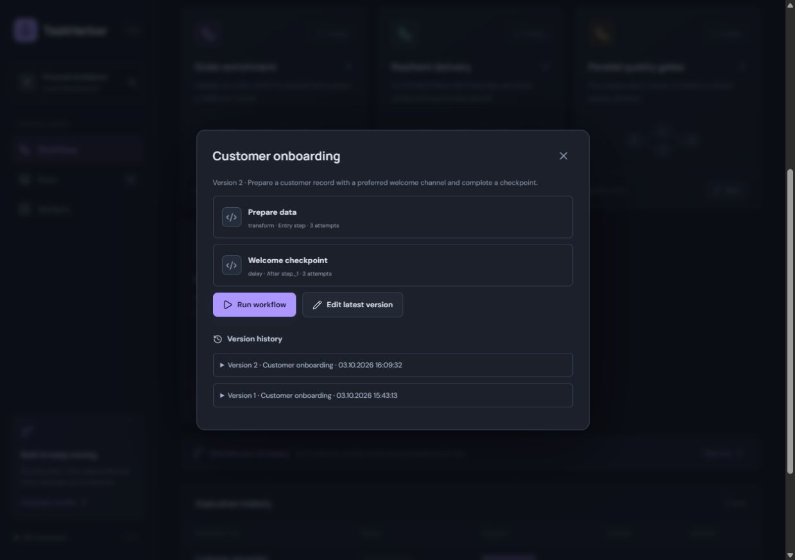
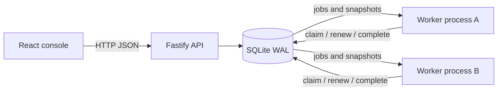
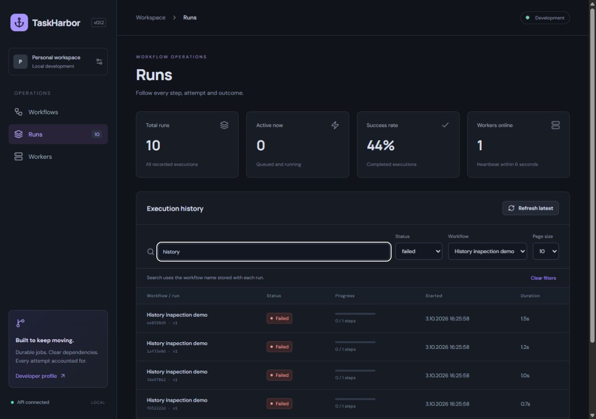

# TaskHarbor

A local-first workflow operations platform: compose dependency graphs, run background jobs and inspect every attempt from a usable web console.

TaskHarbor is an evolving full-stack engineering project. Version 0.1.4 provides a working execution engine and UI; the roadmap grows it toward a multi-user, PostgreSQL-backed service.


## Run locally

Requires **Node.js 24.x** and npm. Docker and external services are not required.

```sh
npm ci
npm run dev
```

Open [localhost:5173](http://127.0.0.1:5173). This starts the API, one worker and Vite. Three sample workflows are seeded only when the database has no workflows.

1. Run **Resilient delivery** to see two controlled failures, backoff and a successful third attempt.
2. Create a workflow with the form. Add steps and choose their dependencies.
3. Open a run to inspect step state, worker ownership, attempts, events and JSON outputs.
4. Start `npm run worker` in a second terminal to execute independent branches concurrently. Run **Parallel quality gates** to observe that behavior.
5. Cancel an active run to invalidate its outstanding job leases.

For a built client, run `npm run build`, then `npm start` and `npm run worker` in separate terminals. Open [localhost:4310](http://127.0.0.1:4310).

## What works today

- React + TypeScript console with responsive layouts, workflow creation/editing, version history, real dependency previews, execution history and a run inspector.
- Fastify API with Zod validation for unique step IDs, acyclic dependencies, missing dependencies and bounded task settings.
- SQLite persistence with WAL and transactional job claims across worker processes on the same machine.
- Five-second leases, one-second renewal, recovery after worker failure and fencing of stale results.
- Persisted attempts, exponential retry backoff, dependency failure propagation and run cancellation.
- Immutable workflow revisions with optimistic editing, versioned run snapshots, worker heartbeats and an append-only execution event trail.
- Safe built-in tasks: merge primitive JSON fields, delay and a controlled failure checkpoint. Tasks consume the run input or merge direct dependency outputs; when keys conflict, dependency order determines the winner.
- Dashboard polling every 1.5 seconds and run detail polling every second.
- Unit, API and real two-worker process tests; a Windows/Linux CI configuration.

## Edit and version a workflow

Open a workflow card, choose **Edit latest version**, make a change and save. Each changed definition becomes a new numbered revision. Existing runs retain their original definition and version. Expand **Version history** to inspect past definitions. If another editor saved first, your draft stays visible; explicitly discard and reload to continue from the latest version.

Existing v0.1 databases migrate automatically on startup. Stop older API/worker processes before upgrading and back up the SQLite database using a consistent SQLite backup. Failed migrations roll back; newer unsupported schemas are rejected.



## Architecture



The API stores definitions and starts runs. Workers claim eligible jobs inside `BEGIN IMMEDIATE` transactions. Only jobs whose dependencies succeeded become eligible. Each claim receives a fresh random token: renewal and completion require that token and an unexpired lease. A cancelled or reassigned job rejects the old result.

Execution is **at least once**, not exactly once. A process can perform an external effect and crash before recording completion. External task types will need explicit idempotency before they are introduced. Cancellation prevents later stored results; it cannot undo an already performed effect.

See [the architecture decision](docs/adr/0001-local-durable-engine.md), [API reference](docs/api.md) and [roadmap](ROADMAP.md).

## Browse execution history

Open **Runs** to search by historical workflow name or run ID, combine status/workflow filters and choose a page size of 5, 10, 25 or 50. **Next** and **Previous** browse older records while keeping an insertion boundary so new arrivals do not shift those pages. **Refresh latest** returns to current records. Statuses continue updating; the boundary does not freeze job state.

The list returns compact summaries and loads inputs/outputs only when a run is opened. Dashboard totals and success rate cover all stored runs. Success rate excludes cancelled and active runs. See [the pagination decision](docs/adr/0003-run-history-pagination.md).



## Quality checks

```sh
npm run check
npm run format:check
npm audit --audit-level=high
```

The suite covers validation, dependency ordering, output propagation, retry timing, attempt exhaustion, lease renewal/recovery, stale result fencing, cancellation, dependency failures, persistence, API errors and parallel execution with two actual worker processes. Run `npm run format` after edits.

## Configuration

| Variable        | Default               | Purpose                                                     |
| --------------- | --------------------- | ----------------------------------------------------------- |
| `TASKHARBOR_DB` | `.data/taskharbor.db` | Shared database path; use the same path for API and workers |
| `PORT`          | `4310`                | API port (Vite proxy assumes the default)                   |
| `WORKER_ID`     | random per process    | Worker label in the inspector                               |

The database and payloads remain local and are ignored by Git. For SQLite, use a local disk; avoid actively syncing the database or placing it on a network filesystem. This checkout is inside OneDrive on the development machine, so choose an unsynced `TASKHARBOR_DB` path for ongoing use.

## Current boundaries

This release binds to loopback and targets one trusted local user. Authentication, tenant isolation, retention, scheduling, production observability and deployment hardening are future work. The API rejects unrelated browser origins, but that is not a substitute for authentication.

Each worker executes one job at a time. SQLite serializes writes and synchronous database calls can block the Node event loop: this is a deliberate small-scale starting point. History provides search, status/workflow filters and anchored cursor pagination; dashboard metrics cover all recorded runs. The legacy `/runs` endpoint still returns the newest 100 full runs for compatibility. Edits create numbered revisions; stale saves return a conflict and unchanged saves keep the current version. Completed runs can be rerun using their original snapshot or the latest workflow. Selecting an arbitrary historical revision or restoring it remains future work. The UI and API accept any valid DAG. There are no arbitrary-code or shell task types. The checkpoint simulates a failure and the quality-gate sample does not actually scan code.

Node's built-in SQLite API is experimental in Node 24. The project pins its supported major version and keeps database access behind `Store` so a later adapter can replace it.

## Development approach

Use a feature issue with measurable acceptance criteria, a focused implementation, relevant tests and an honest PR description. Add meaningful features over time; avoid empty commits or manufactured activity. [CONTRIBUTING.md](CONTRIBUTING.md) describes the workflow.

## Türkçe

TaskHarbor; akış oluşturma, arka plan görevleri, yeniden deneme, worker takibi ve çalışma geçmişini birleştiren bir full-stack projedir. İlk sürüm yerelde çalışır. Uzun vadede PostgreSQL, kimlik doğrulama, zamanlama, güvenli entegrasyonlar ve gözlemlenebilirlik ekleyeceğiz. Amaç, portföyde gösterilebilen bir ürünün yanında test ve mimari kararlarla desteklenen gerçek geliştirme geçmişi oluşturmaktır.

## Rerun with edited input

Open a completed, failed or cancelled run and choose **Rerun with edited input**. Keep **Source snapshot** to reproduce its definition, or select **Latest workflow** to try a fix. Edit the JSON object and start a new execution. The source remains unchanged, every step gets fresh attempts, and **Source run** links the new execution to its parent. A stale latest-version selection returns a conflict and offers an explicit reload.

Repeated submission of the same request creates one execution, including concurrent API processes. This deduplicates run creation, not task side effects. See [the rerun decision](docs/adr/0004-rerun-requests.md).


## Console design

The workspace overview displays live workflow, active-run and online-worker counts from the local API. Workflow cards show their actual dependency graph, entry-step count and connection count. Stable identity-based accents stay consistent while searching. Responsive cards and an icon navigation rail keep the console usable on smaller screens; focus indicators and reduced-motion preferences are supported.
