# v0.1 verification

Local verification performed on Windows with Node 24.21.0.

- Eleven automated tests passed, including an integration test that starts two real worker processes and observes simultaneous independent jobs.
- TypeScript checking and the Vite production build passed.
- Prettier checking passed; npm audit reported zero known vulnerabilities at verification time.
- Browser: created a two-step Customer onboarding workflow, saved it, launched it and observed both steps succeed with the configured merged JSON field.
- Browser: Resilient delivery failed twice, persisted 1000ms and 2000ms retry delays, then completed its third attempt and downstream receipt step.
- Browser: checked the console at 1440×1000 and 390×844. At the narrow size, document width equalled viewport width; the execution table scrolls within its own container.
- Browser: opened the production-built client served by Fastify and verified API-backed workflows and run history.

Screenshots contain real local API results with synthetic demonstration payloads. The extra Customer onboarding workflow was created during browser verification and is not part of the three default seed definitions.

The checked-in CI workflow targets Windows and Linux. Its remote execution status must be read from GitHub Actions; local success alone does not establish a green hosted build.

## v0.1.1 verification

- Eighteen automated tests cover the existing engine plus revision immutability, active-run isolation, stale API writes, no-op/invalid edits, migration/reopen preservation, unsupported versions, atomic migration rollback and concurrent editor processes.
- Browser verification with two simultaneous editor tabs: the first save created revision 2; the second stale save was rejected with a visible conflict while retaining its draft. Explicit reload replaced it with the latest definition.
- Version history displayed revisions 2 and 1. A subsequent run identified workflow v2 while the old execution remained v1.
- The migrated local database retained existing workflows, runs and event history.

## v0.1.2 verification

- Twenty-six tests cover history ordering with timestamp ties, page completeness, insertion boundaries, Unicode/literal search, historical workflow names, combined filters, compact summaries, cursor validation, API bounds and global counts beyond 100 runs, alongside the existing execution and revision tests.
- Created seven synthetic runs in a local History inspection demo workflow: five controlled failures, one cancellation and one successful run after revision. These are verification records, not default seed data or external integrations.
- Browser: chose five rows per page, navigated to the older second page and inspected its anchored-history indicator.
- Browser: combined failed status and name search, verified the five matching synthetic failures, and checked the no-results state.
- Browser: combined workflow and status filters, opened the 390px layout, confirmed no document overflow, and exercised clear filters. The execution table scrolls inside its container.

## v0.1.3 verification

- Thirty-three automated tests passed, including source snapshot preservation, latest-version selection, fresh attempts, cancelled sources, lineage chains, canonical request replay, conflicts and two concurrent real submission processes.
- Browser: an array input was rejected with a visible JSON-object validation message.
- Browser: reran a failed v1 checkpoint using its source snapshot; the new v1 run failed as expected while the source remained unchanged. Followed the source-run link back to the original.
- Browser: selected latest v2 and edited input; the new execution succeeded and its output contained the edited verification field and inspected=true. The inspector displayed its source link and rerun event.
- Screenshot uses synthetic local verification data.

## v0.1.4 console verification

- Browser checked at 1440×1100 and 390×844 with live local API records.
- At 390px, document scroll width was 375px (scrollbar excluded), with no horizontal document overflow.
- Workflow search displayed the new no-results state; clearing restored cards.
- Opened and closed workflow creation on mobile, navigated to execution history and returned to workflows.
- Engine counts matched the current workspace: five workflows, zero active runs and one online worker.
- Desktop and mobile screenshots use existing synthetic verification records.

## v0.1.5 portable workflow verification

- Thirty-seven tests passed. New cases cover all seeded DAG roundtrips, identity/history exclusion, default normalization, preview without writes, latest-revision export, unknown fields, unsupported tasks/versions, invalid graphs, malformed JSON, request-size limits and origin guards.
- Browser: rejected format version 2, previewed a valid two-step document, renamed it and created Imported onboarding at revision 1. Workspace workflow count increased while run count remained unchanged until explicitly launched.
- Browser: exported the imported definition and inspected its normalized selectable JSON. The automated in-app download-event capture timed out; downloaded file delivery was not confirmed by that automation.
- Browser: explicitly launched the imported workflow and verified its execution separately. Synthetic demonstration data only.

## v0.1.6 execution map verification

- Forty tests cover prior behavior plus deterministic layout of unsorted branches, dependency direction, maximum depth/width (20 steps), node bounds/non-overlap and defensive rejection of cyclic/missing/duplicate graph nodes.
- Browser: launched Parallel quality gates, observed its queued graph and successful completion, selected Quality gate and inspected its output and two step-specific events. Clear selection restored all ten events.
- Browser: selected a failed historical checkpoint and verified its error, attempt exhaustion and absence of output. Escape dismissed the inspector.
- At 390px, document width stayed at 375px; the four-step graph had 684px content inside a 291px scroll area without page overflow. Returned viewport to default.
- Screenshots show real local runs with synthetic payloads.

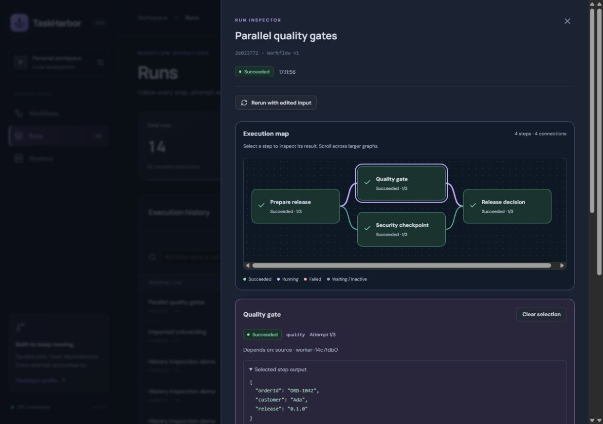
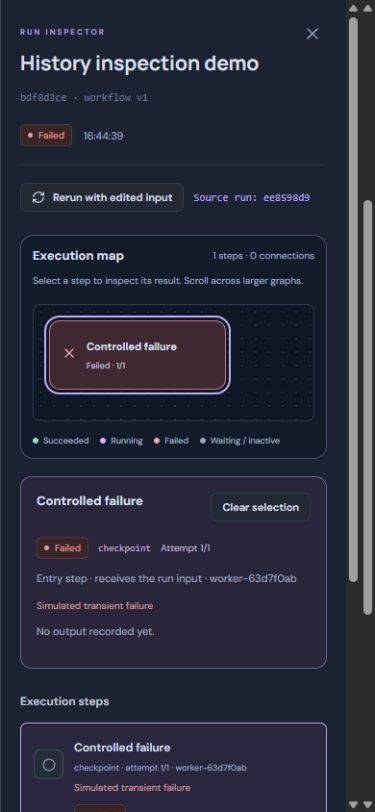

## v0.1.7 revision comparison verification

- Forty-four tests include addition/removal/modification classification, metadata, snapshot immutability, key-order equivalence, dependency-order changes, sequence-only changes, missing/null/false/zero values, dotted field keys, identity rename, reverse comparison and identical definitions.
- Browser: compared Customer onboarding v1 → v2 and inspected description changes plus the added welcomeChannel transform field.
- Swap reversed before/after values. Selecting v2 → v2 showed identical definitions with zero changes.
- At 390px, document width was 375px with no horizontal overflow; field values stack vertically. Screenshots use existing synthetic workflow revisions.

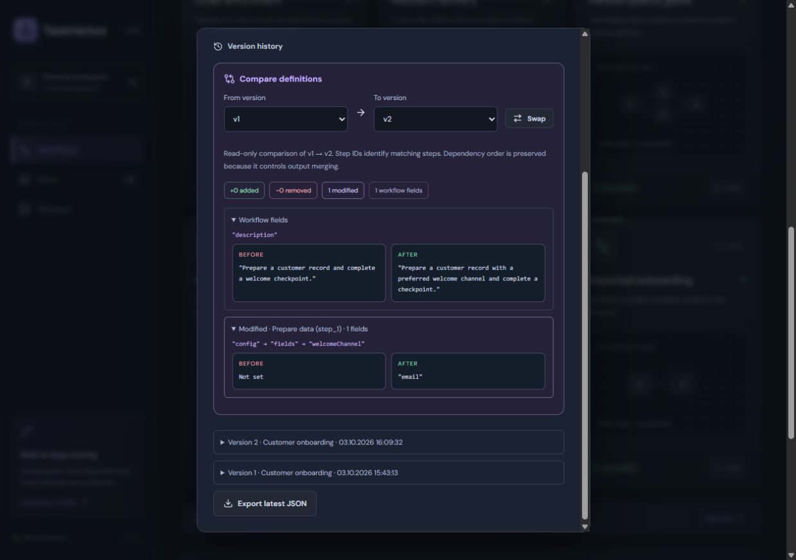
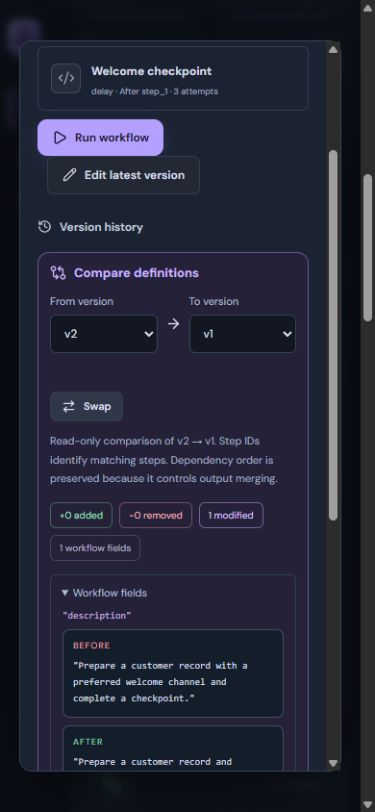

## v0.1.8 event investigation verification

- Forty-eight tests include combined categories/step selection, literal Unicode search across messages/types/IDs, append-ID ordering with timestamp ties, immutable filtering, new event arrivals and severity classification.
- Browser: opened the existing Resilient delivery execution, selected Retries and Newest first, and observed its 2000ms retry before its 1000ms retry.
- Search 2000ms returned one of twelve events; unmatched text displayed a clear no-results state. Selecting deliver combined correctly with retry filters; clearing restored all twelve records and removed step selection.
- Mobile 390px: searching job.retry returned two events; document width stayed at 375px with no horizontal overflow. Viewport was reset after verification.
- Progressive rendering beyond 50 records was implemented but not exercised in this browser fixture, which has twelve events. Event filtering remains client-side.

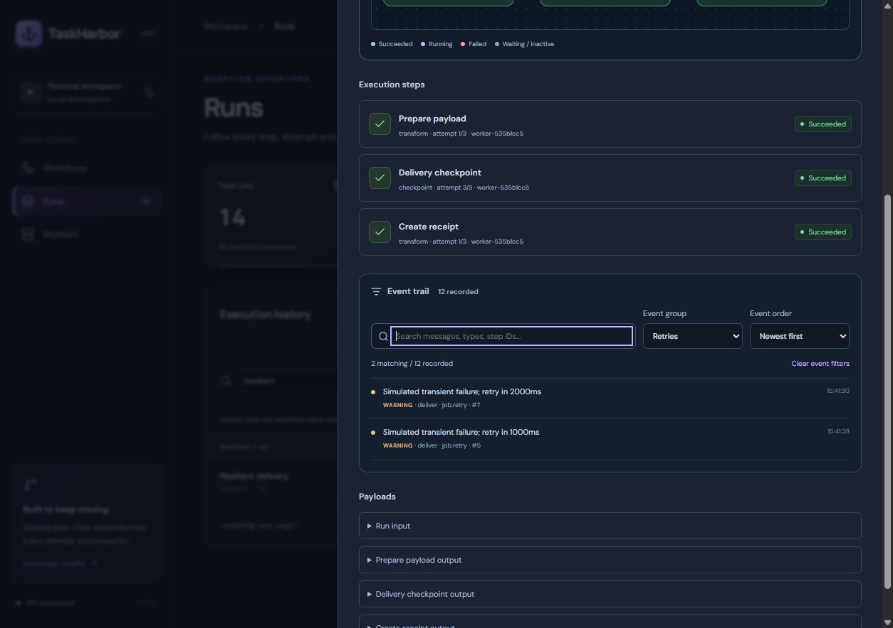
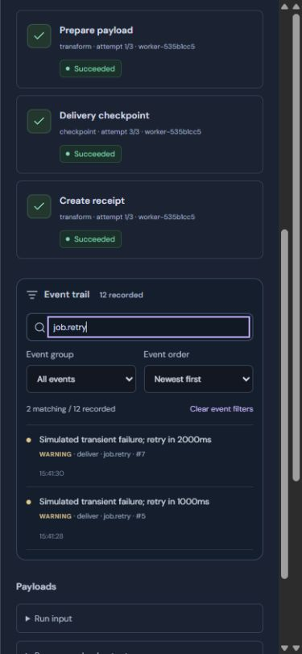

## v0.1.9 server-side event pagination verification

- Fifty-three tests passed, including five new event API/store cases: 126 timestamp-tied events traversed completely in both directions; run isolation; append-boundary stability; Unicode/literal SQL search; combined filters; cursor rejection; 50-row response bounds; legacy detail compatibility and invalid query handling.
- Production TypeScript/Vite build passed.
- Browser: a local synthetic 20-step checkpoint workflow completed with two attempts per step, producing 82 persisted events through the actual worker. The inspector returned 50 events on the first page and 32 on the anchored second page; the final continuation button was disabled.
- Refresh latest restored the live first page. Retries returned 20 of 82 records; searching check_19 within that group returned one record. Clearing restored all events.
- At 390px, document width remained 375px with no horizontal overflow, and retry filtering rendered 20 records with visible refresh/continuation controls. Viewport was reset afterward.
- Event responses are bounded; substring search and counts still scan the run's stored events. No high-volume throughput claim is made.

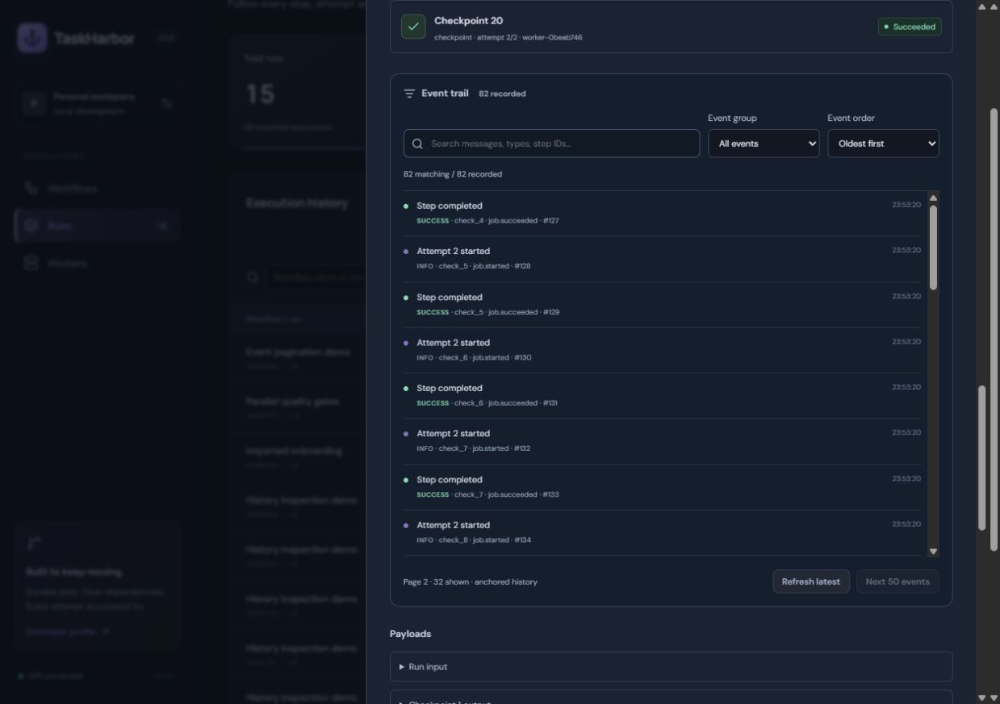
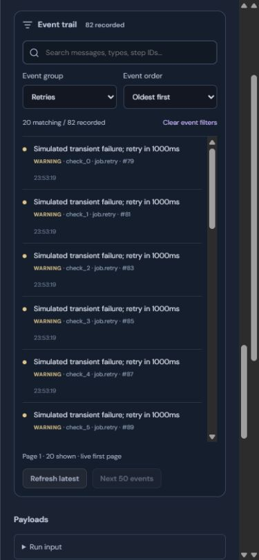

## v0.1.10 event navigation verification

- Fifty-four tests and the production build passed. The new test verifies first-page revisits against appended events in both sort directions, plus zero/invalid boundaries.
- Browser: traversed the existing 82-event fixture from page 1 to page 2 and back to the anchored first page. Previous was disabled at the first page; Refresh latest restored its live mode.

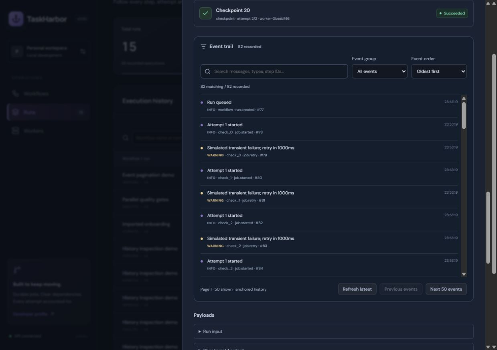

## v0.1.11 historical copy verification

- Fifty-six tests and the production build passed. New tests verify definition-only copying, deep isolation, bounded names and saving an old revision with a fresh ID/version while preserving the source and its existing run.
- Browser: opened Customer onboarding v1 while its latest version was v2. The draft contained v1's original description and transform fields, with a suggested version-labelled name.
- Cancel discarded the first draft. A second draft was renamed Historical onboarding copy and saved at v1. Workflow count increased from 7 to 8, source stayed at v2 and run count remained 15. Synthetic local demonstration data only.
- The development server briefly cached an empty module during filesystem writes; restarting the development processes restored it. The production build passed independently.

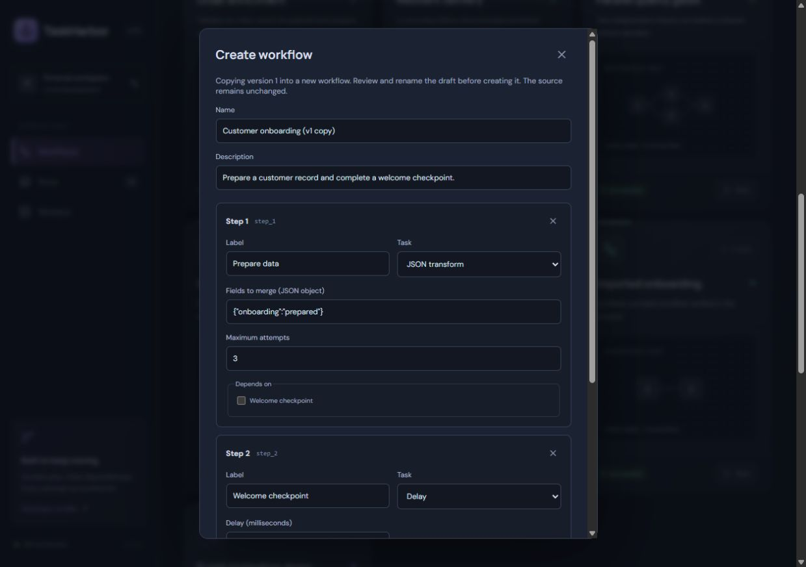

## v0.2.0 visual studio verification

- Sixty-seven unit/API/process tests passed, retaining all previous fifty-six. New cases cover graph direction and rejection, cleanup, merge order, ID/count bounds, grouped history, shared validation, draft recovery/corruption/storage denial, key separation and camera-independent undo.
- Eleven production Chromium E2E tests passed against a fresh temporary database and actual worker: branching execution/output, invalid graph/JSON, undo/redo, reload recovery and cleanup, historical copies, live and recovered version conflicts, 390px forms, handle connections, grouped drag undo, storage denial, failed writes, layout-only version preservation, palette drag and keyboard movement/deletion.
- Local browser: authored Studio onboarding demo with four transform tasks and four connections, recovered it across reload, checked desktop and 390px views, saved at v1 and launched it explicitly. The worker completed all steps; Join branches output contained prepared, customerReady, checked and joined flags alongside the input. Synthetic demonstration data only.
- The new-workflow count increased from 8 to 9 without running until explicitly requested; execution count increased from 15 to 16 after launch. Viewport override was reset.
- A controlled-canvas measurement issue was found during visual QA and corrected; handle tests wait for finalized node placement before pointer input. The final full suite passed after these fixes.
- TypeScript/Vite build, formatting and high-severity audit checks passed; npm reported zero vulnerabilities. Full assistive-technology review is not claimed.

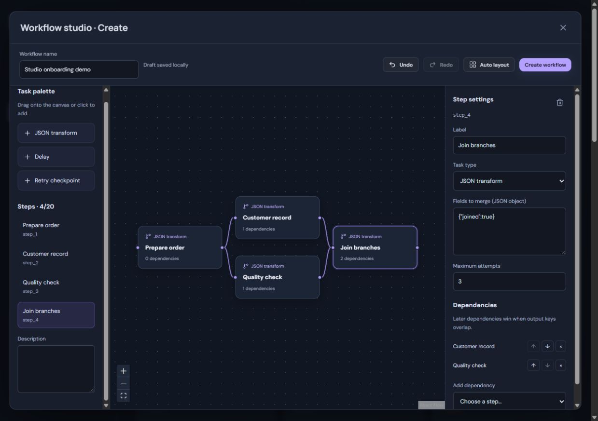
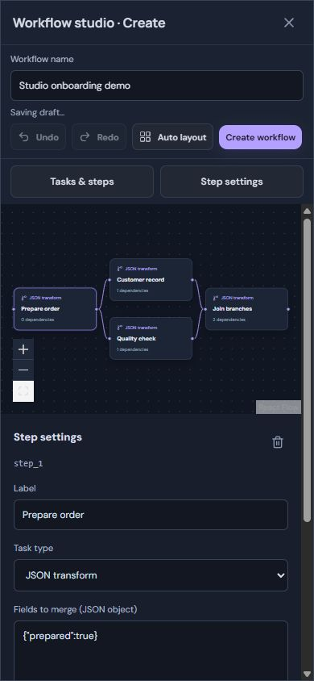
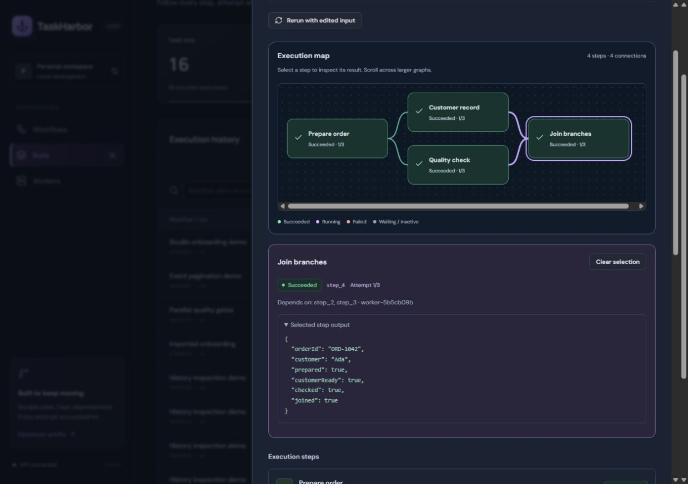

- Initial Linux E2E CI exposed a pointer-coordinate race after fit-view. Handle gestures now use locator stability checks and await font readiness instead of precomputed screen coordinates; the pointer gesture and graph assertions remain intact.
