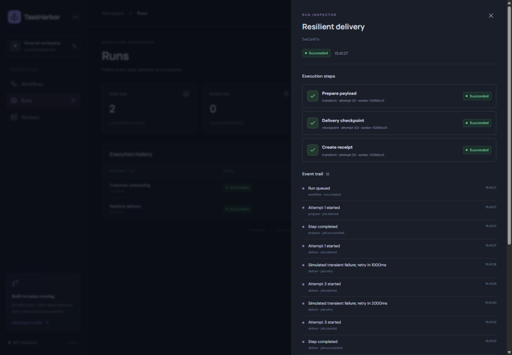
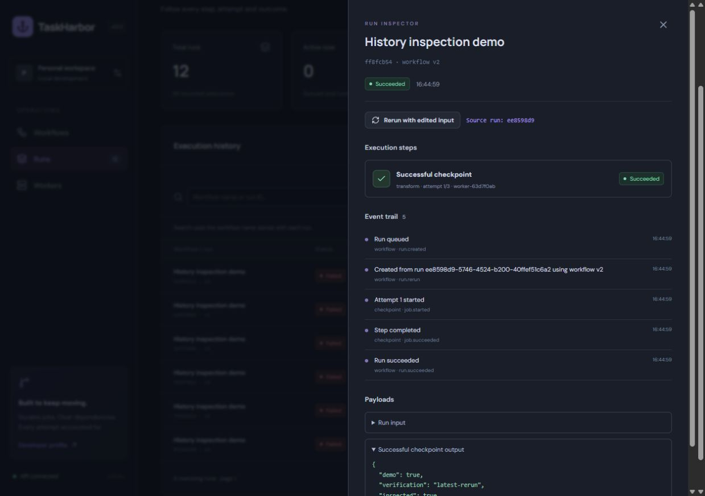
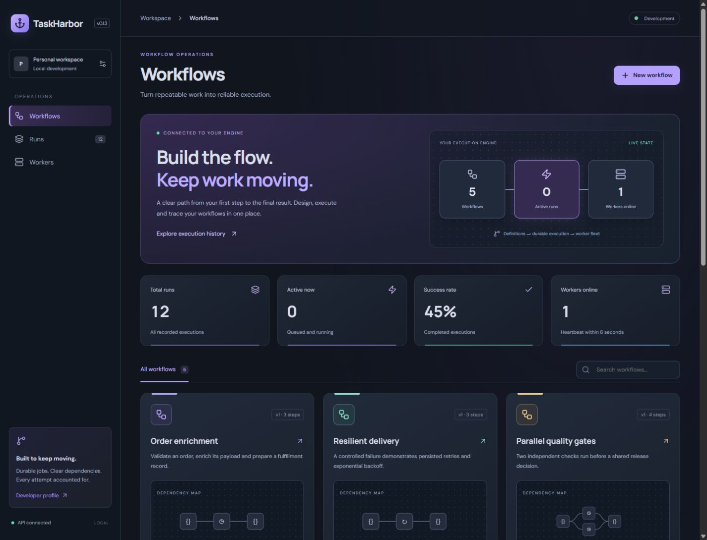
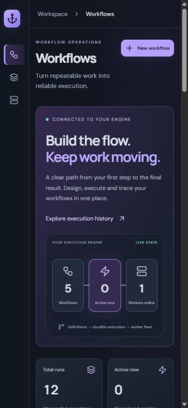
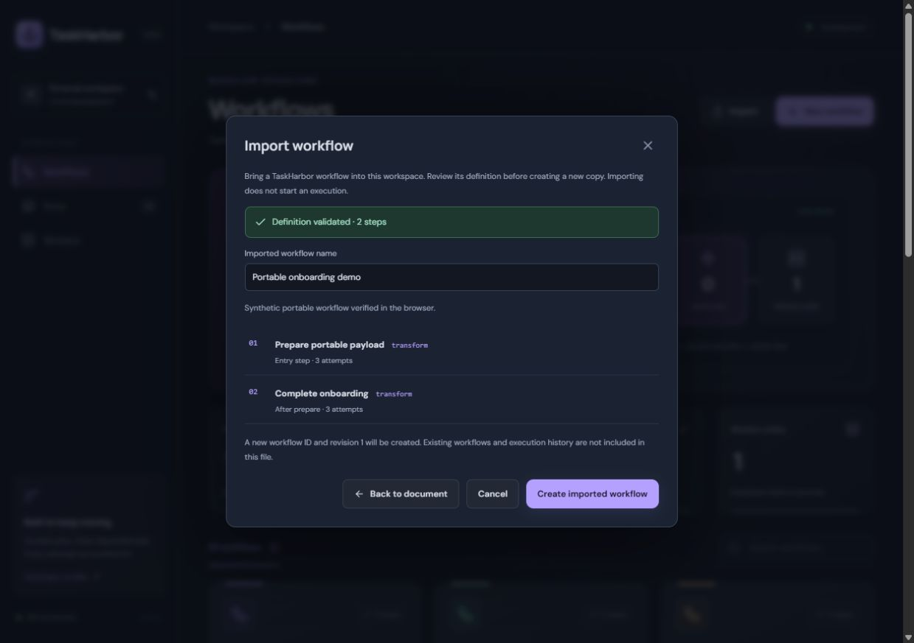
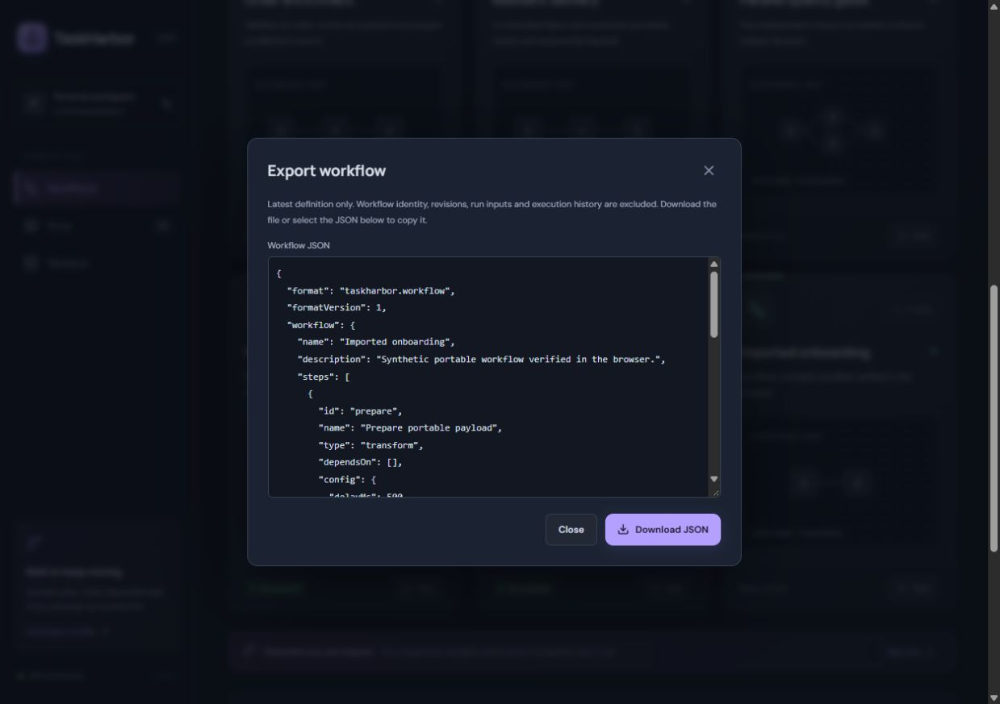

# v0.1 verification

Local verification performed on Windows with Node 24.21.0.

- Eleven automated tests passed, including an integration test that starts two real worker processes and observes simultaneous independent jobs.
- TypeScript checking and the Vite production build passed.
- Prettier checking passed; npm audit reported zero known vulnerabilities at verification time.
- Browser: created a two-step Customer onboarding workflow, saved it, launched it and observed both steps succeed with the configured merged JSON field.
- Browser: Resilient delivery failed twice, persisted 1000ms and 2000ms retry delays, then completed its third attempt and downstream receipt step.
- Browser: checked the console at 1440×1000 and 390×844. At the narrow size, document width equalled viewport width; the execution table scrolls within its own container.
- Browser: opened the production-built client served by Fastify and verified API-backed workflows and run history.

Screenshots contain real local API results with synthetic demonstration payloads. The extra Customer onboarding workflow was created during browser verification and is not part of the three default seed definitions.

The checked-in CI workflow targets Windows and Linux. Its remote execution status must be read from GitHub Actions; local success alone does not establish a green hosted build.

## v0.1.1 verification

- Eighteen automated tests cover the existing engine plus revision immutability, active-run isolation, stale API writes, no-op/invalid edits, migration/reopen preservation, unsupported versions, atomic migration rollback and concurrent editor processes.
- Browser verification with two simultaneous editor tabs: the first save created revision 2; the second stale save was rejected with a visible conflict while retaining its draft. Explicit reload replaced it with the latest definition.
- Version history displayed revisions 2 and 1. A subsequent run identified workflow v2 while the old execution remained v1.
- The migrated local database retained existing workflows, runs and event history.

## v0.1.2 verification

- Twenty-six tests cover history ordering with timestamp ties, page completeness, insertion boundaries, Unicode/literal search, historical workflow names, combined filters, compact summaries, cursor validation, API bounds and global counts beyond 100 runs, alongside the existing execution and revision tests.
- Created seven synthetic runs in a local History inspection demo workflow: five controlled failures, one cancellation and one successful run after revision. These are verification records, not default seed data or external integrations.
- Browser: chose five rows per page, navigated to the older second page and inspected its anchored-history indicator.
- Browser: combined failed status and name search, verified the five matching synthetic failures, and checked the no-results state.
- Browser: combined workflow and status filters, opened the 390px layout, confirmed no document overflow, and exercised clear filters. The execution table scrolls inside its container.

## v0.1.3 verification

- Thirty-three automated tests passed, including source snapshot preservation, latest-version selection, fresh attempts, cancelled sources, lineage chains, canonical request replay, conflicts and two concurrent real submission processes.
- Browser: an array input was rejected with a visible JSON-object validation message.
- Browser: reran a failed v1 checkpoint using its source snapshot; the new v1 run failed as expected while the source remained unchanged. Followed the source-run link back to the original.
- Browser: selected latest v2 and edited input; the new execution succeeded and its output contained the edited verification field and inspected=true. The inspector displayed its source link and rerun event.
- Screenshot uses synthetic local verification data.

## v0.1.4 console verification

- Browser checked at 1440×1100 and 390×844 with live local API records.
- At 390px, document scroll width was 375px (scrollbar excluded), with no horizontal document overflow.
- Workflow search displayed the new no-results state; clearing restored cards.
- Opened and closed workflow creation on mobile, navigated to execution history and returned to workflows.
- Engine counts matched the current workspace: five workflows, zero active runs and one online worker.
- Desktop and mobile screenshots use existing synthetic verification records.

## v0.1.5 portable workflow verification

- Thirty-seven tests passed. New cases cover all seeded DAG roundtrips, identity/history exclusion, default normalization, preview without writes, latest-revision export, unknown fields, unsupported tasks/versions, invalid graphs, malformed JSON, request-size limits and origin guards.
- Browser: rejected format version 2, previewed a valid two-step document, renamed it and created Imported onboarding at revision 1. Workspace workflow count increased while run count remained unchanged until explicitly launched.
- Browser: exported the imported definition and inspected its normalized selectable JSON. The automated in-app download-event capture timed out; downloaded file delivery was not confirmed by that automation.
- Browser: explicitly launched the imported workflow and verified its execution separately. Synthetic demonstration data only.

